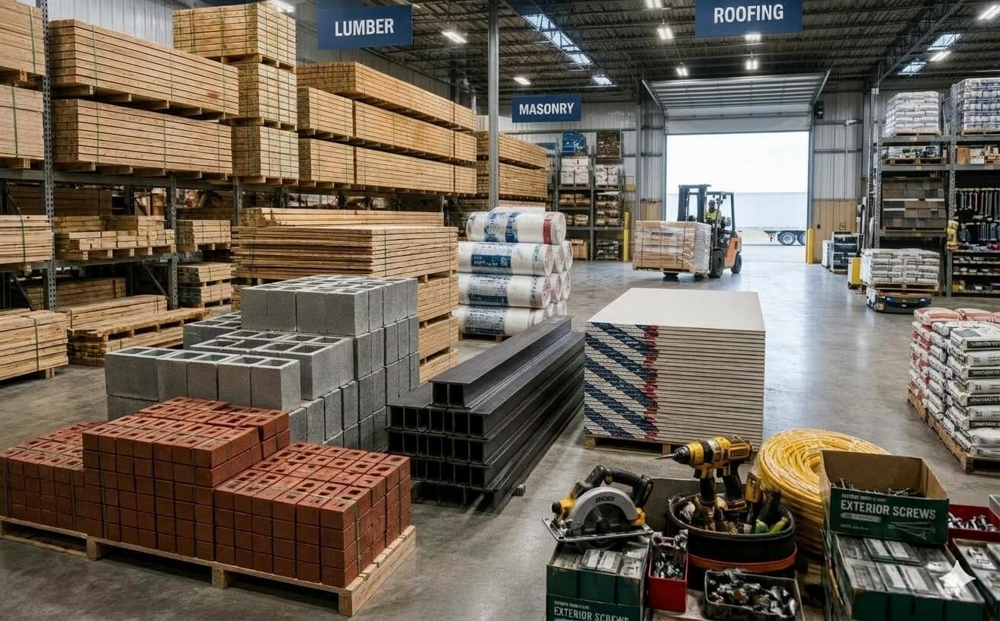

<h2 align="left"><strong>About Me</strong></h2>

 Microsoft Certified (PL-300 & DP-600) Data Professional combining a strong background in Accounting & Finance with diverse industry experience across FMCG, Real Estate, Trading, and Transportation. I specialize in data analytics, financial analysis, statistical analysis, ETL pipeline design, report automation, data modeling, and dashboard development, transforming raw data into a strategic business asset. Driven by the mission to “uncover the story behind the numbers,” I translate complex datasets into measurable business value that supports organizational goals.

I genuinely love diving into large datasets with SQL and Python to transform raw, complex data into clear, actionable business insights.

<strong>A huge fan of Python’s Pandas library!<strong>

 

<strong>Core Languages:<strong> SQL, Python 
<strong>Microsoft Ecosystem:<strong> Fabric, Power BI, DAX, Power Query, Excel

**[My Linkedin Profile](https://www.linkedin.com/in/nafrees/)**

 

## Python Project

### [Building Materials Sales Analysis](https://github.com/nafreesv/Data-Analytics-Portfolio/blob/main/Building_Material_Transactions.ipynb)

 

## SQL Project

### [Car Sales Analysis](https://github.com/nafreesv/Data-Analytics-Portfolio/blob/main/car_sales.ipynb)

